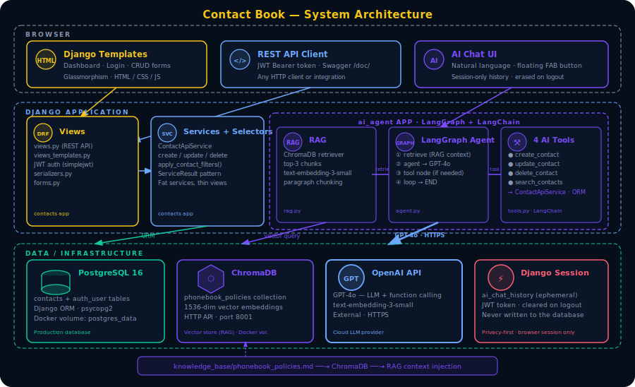

# Contact Book - Personal Phonebook with AI Agent

<p>
  
  
  
  
  
  
  
  
  
</p>


A production-ready full-stack phonebook application with two distinct layers: a **Django + DRF REST API** with a server-rendered HTML frontend, and an **autonomous AI agent** (LangGraph + GPT-4o + RAG) that performs real CRUD operations on your contacts through natural language conversation.

---

## Live Demo

| Environment  | URL |
|--------------|-----|
| **Web App**  | [phonebook.mahdi-sahami.com](https://phonebook.mahdi-sahami.com/) |
| **Admin**    | [phonebook.mahdi-sahami.com/admin/](https://phonebook.mahdi-sahami.com/admin/login/?next=/) |

Use the following credentials to explore as a read-only observer:
```
username: test
password: test
```
## Admin Panel


The Django admin panel is fully customised for a better user experience - list views show computed fields, search is wired up across related models, and inline editing is available for related objects.

---

## Main Application


The core phonebook app is production-ready and usable end-to-end from both the web UI and the REST API.

### Features

- **Full CRUD** - create, read, update, and delete contacts; name and phone are required, email and address are optional
- **Live search** - instant autocomplete suggestions while typing; filter by name, phone, email, or address with multiple sort orders
- **Multi-user isolation** - every user sees and manages only their own contacts; no cross-user data leakage
- **REST API** - full CRUD endpoints, JWT authentication, and Swagger/OpenAPI docs at `/doc/`
- **Responsive UI** - dark glassmorphism design built with plain HTML, CSS, and JavaScript via Django templates

### Technology Stack

| Layer         | Technology                                    |
|---------------|-----------------------------------------------|
| Backend       | Django 6, Django REST Framework               |
| Auth          | JWT (`djangorestframework-simplejwt`)         |
| Database      | PostgreSQL (production), SQLite (development) |
| API Docs      | drf-yasg (Swagger / OpenAPI)                  |
| Static files  | WhiteNoise                                    |
| Container     | Docker + Docker Compose                       |

---

## AI Agent Layer


The second layer is a fully autonomous AI agent. Users manage their contacts through natural language - the agent decides which tool to call, executes it, and replies with the result.

> [!IMPORTANT]
> This is an **autonomous agent**, not just an AI assistant. The agent executes real database operations (create, update, delete, search) on behalf of the user. It does not ask for confirmation in most cases — it acts and reports back.


## Architecture



---

### How It Works

1. The user sends a message via the chat page (`/ai/`)
2. The LangGraph agent runs the following loop:
   - **Retrieve** - fetches the top-3 relevant policy/feature chunks from **ChromaDB** (RAG), I could use Qdrant as well but for the sake of portfolio, I s continued with ChromaDB
   - **Agent** - sends the message + retrieved context + chat history to **GPT-4o** (it can connect to any other LLM as well)
   - **Tools** - if the LLM decides to call a tool, the tool is executed against the Django ORM directly (no HTTP round-trips)
   - Loops until no more tool calls are needed, then returns the final answer
3. Chat history is stored in the **Django session** (ephemeral - erased on logout or browser close)

### Agent Graph

```
START
  │
  ▼
retrieve   ← ChromaDB RAG: top-3 policy chunks injected into system prompt
  │
  ▼
agent      ← LLM (we used GPT-4o): decide next action
  │
  ├── tool call? ──w► tools ──► back to agent
  │
  └── done? ──► END
```

### Agent Tools

| Tool              | Underlying call                     | Description                                   |
|-------------------|-------------------------------------|-----------------------------------------------|
| `create_contact`  | `ContactApiService.create_contact`  | Create a new contact                          |
| `update_contact`  | `ContactApiService.update_contact`  | Update fields of an existing contact by ID    |
| `delete_contact`  | `ContactApiService.delete_contact`  | Permanently delete a contact by ID            |
| `search_contacts` | `apply_contact_filters`             | Search contacts by keyword, email, or address |

Every tool is bound to the authenticated user - the agent cannot touch another user's data.

> [!NOTE]
> Tools call `ContactApiService` and `apply_contact_filters` via the ORM directly - no HTTP self-calls. This avoids authentication overhead, round-trip latency, and circular request loops.

---
### Design Decisions

- **Application advantages - no need to reasoning models**: since I developed the full tools with proper prompts, the system can work even with GPT-4o which is not a reasoning model. therefore, in a production, it will significantly reduce the costs of the company while keeps the efficiency.
- **`OpenAI text-embedding-3-small`**: the knowledge base is a short, well-structured policy document. Small embeddings are fast and cost-effective here which reduce the costs while keeping the effeicincny.
- **Simple paragraph chunking**: the policies file is short and well-structured - recursive or semantic chunking adds latency for zero gain. I had all the advanced chuncking techniques but the text does not require it.
- **Session-based memory**: privacy-first design - no chat history ever touches the database.
- **LangGraph and LangChain**: For the sake of the portfolio, I developed the agents using LangGraph with the toolbox of LangChain. I could use OpenAI's SDK, CrewAI and other options as well. 

---

## Knowledge Base

The AI agent is grounded in a policy document (`knowledge_base/phonebook_policies.md`) loaded into ChromaDB at startup. This document defines what the agent knows about the application's rules, features, and limitations.


---


## Project Structure

```
contact/
├── ai_agent/                   # AI agent Django app
│   ├── enums.py                # ToolName, AgentNode, SessionKey enums
│   ├── tools.py                # 4 LangChain tools (sync + async)
│   ├── rag.py                  # ChromaDB vector store + retriever (thread-safe singleton)
│   ├── agent.py                # LangGraph state machine
│   ├── views.py                # ChatPageView, ChatApiView, ClearChatView
│   ├── urls.py                 # /ai/* URL routing
│   └── templates/ai_agent/
│       └── chat.html           # Chat UI (glassmorphism)
├── contacts/                   # Main phonebook app
│   ├── models.py               # Contact model (FK → User)
│   ├── services.py             # ContactApiService + ServiceResult dataclass
│   ├── selectors.py            # apply_contact_filters, build_suggestions
│   ├── serializers.py          # DRF serializers
│   ├── forms.py                # Django form classes
│   ├── views.py                # REST API views (ContactView, RegisterView)
│   ├── views_templates.py      # Template views (login, register, dashboard, CRUD)
│   ├── urls.py                 # API URL patterns
│   └── urls_templates.py       # Template URL patterns
├── contact/                    # Django project config
│   ├── settings.py             # All settings (JWT, ChromaDB, OpenAI, WhiteNoise)
│   └── urls.py                 # Root URL configuration
├── knowledge_base/
│   └── phonebook_policies.md   # RAG knowledge base (loaded into ChromaDB)
├── docker-compose.yml          # web + PostgreSQL 16 + ChromaDB
├── dockerfile
├── entrypoint.sh
└── requirements.txt
```

---

## API Endpoints

| Method | Endpoint              | Description                          |
|--------|-----------------------|--------------------------------------|
| POST   | `/api/login/`         | Obtain JWT access and refresh tokens |
| POST   | `/api/register/`      | Create a new user account            |
| POST   | `/api/token/refresh/` | Refresh JWT access token             |
| GET    | `/contacts/`          | List all contacts for the user       |
| POST   | `/contacts/`          | Create a new contact                 |
| PUT    | `/contacts/<id>/`     | Update a contact                     |
| DELETE | `/contacts/<id>/`     | Delete a contact                     |
| POST   | `/ai/chat/`           | Send a message to the AI agent       |
| POST   | `/ai/clear/`          | Clear session chat history           |
| GET    | `/doc/`               | Swagger / OpenAPI documentation      |
| GET    | `/admin/`             | Django admin panel                   |


---

## Engineering Practices

- **SOLID + Separation of Concerns** - independent layers for models, services, selectors, views, serializers, agent, tools, and RAG
- **Fat service(model), thin views** - all business logic lives in `ContactApiService` and selector functions; views delegate
- **DRY** - shared enums (`ToolName`, `AgentNode`, `SessionKey`) eliminate magic strings; `build_tools` factory avoids repetition
- **Type annotations** - all functions and classes are fully annotated with Python type hints
- **No HTTP self-calls** - agent tools use the Django ORM directly, never HTTP round-trips to the same server

---

## Getting Started

### Prerequisites

- Python 3.12+
- Docker and Docker Compose (recommended)
- OpenAI API key (required for the AI agent)

### Option A — Docker Compose (recommended)

Starts three services: Django web app, PostgreSQL 16, and ChromaDB.

```bash
git clone https://github.com/mahdi-sahami/phonebook.git
cd phonebook

# Create .env with required variables (see table below)

docker-compose up --build
```

- Web UI: https://phonebook.mahdi-sahami.com
- API docs: https://phonebook.mahdi-sahami.com/doc/
- Admin: https://phonebook.mahdi-sahami.com/admin/

### Option B - Local Development (SQLite + local ChromaDB)

```bash
git clone https://github.com/mahdi-sahami/phonebook.git
cd phonebook

python -m venv .venv
source .venv/bin/activate   # Windows: .venv\Scripts\activate

pip install -r requirements.txt

export SECRET_KEY="your-secret-key"
export OPENAI_API_KEY="sk-..."
export DEBUG=True
# Leave DB_ENGINE unset — the app falls back to SQLite automatically

python manage.py migrate
python manage.py createsuperuser
python manage.py collectstatic
python manage.py runserver
```

### Environment Variables

| Variable               | Required         | Description                                                               |
|------------------------|------------------|---------------------------------------------------------------------------|
| `SECRET_KEY`           | Yes              | Django secret key                                                         |
| `OPENAI_API_KEY`       | Yes (AI agent)   | OpenAI API key (GPT-4o + embeddings)                                      |
| `DEBUG`                | No               | `True` for development, `False` for production                            |
| `ALLOWED_HOSTS`        | Yes (production) | Comma-separated allowed hostnames                                         |
| `CSRF_TRUSTED_ORIGINS` | Yes (production) | Comma-separated trusted origins                                           |
| `DB_ENGINE`            | No               | Set to `django.db.backends.postgresql` for PostgreSQL; omit for SQLite    |
| `DB_NAME`              | Yes (PostgreSQL) | PostgreSQL database name                                                  |
| `DB_USER`              | Yes (PostgreSQL) | PostgreSQL user                                                           |
| `DB_PASSWORD`          | Yes (PostgreSQL) | PostgreSQL password                                                       |
| `DB_HOST`              | Yes (PostgreSQL) | PostgreSQL host (e.g. `db` in Docker Compose)                             |
| `DB_PORT`              | No               | PostgreSQL port (default: `5432`)                                         |
| `CHROMA_HOST`          | No               | ChromaDB host — set to `chroma` in Docker Compose; leave empty for local  |
| `CHROMA_PORT`          | No               | ChromaDB port (default: `8001`)                                           |
| `CHROMA_PERSIST_DIR`   | No               | Local ChromaDB persistence directory (default: `./chroma_db`)             |
| `API_PAGE_SIZE`        | No               | Contacts per page in the API (default: `20`)                              |
| `CORS_ALLOW_ALL_ORIGINS` | No             | Set to `False` in production and configure `CORS_ALLOWED_ORIGINS` instead |

---

## Production Deployment

- Set `DEBUG=False`, a strong `SECRET_KEY`, and correct `ALLOWED_HOSTS` / `CSRF_TRUSTED_ORIGINS`
- Use PostgreSQL and configure all `DB_*` variables
- Set `CHROMA_HOST` to point to a running ChromaDB container
- Static files are served via WhiteNoise (already configured)
- Docker Compose starts all three services (`web`, `db`, `chroma`) with health checks and restart policies

---

---

## Testing & CI/CD

### Running Tests Locally

The test suite uses Django's built-in test runner with SQLite in-memory and all external services (OpenAI, ChromaDB) mocked.

```bash
# Install dependencies (includes coverage)
pip install -r requirements.txt

# Run all tests
python manage.py test 

```

**Current results: 160 tests, 0 failures, 95% coverage**

### Test Coverage by Module

| Module | Coverage |
|--------|----------|
| `contacts/models.py` | 100% |
| `contacts/services.py` | 97% |
| `contacts/selectors.py` | 100% |
| `contacts/serializers.py` | 100% |
| `contacts/forms.py` | 100% |
| `contacts/views.py` | 98% |
| `contacts/views_templates.py` | 94% |
| `ai_agent/tools.py` | 89% |
| `ai_agent/views.py` | 88% |
| `ai_agent/enums.py` | 100% |
| **Total** | **95%** |

### What Is Tested

- **Contact model** — CRUD, cascade delete, owner isolation
- **ContactApiService** — login, register, list, create, update, delete (all success + failure paths)
- **Selectors** — `apply_contact_filters` (q, email, address, ordering, user isolation) and `build_suggestions`
- **Serializers** — field validation, write-only password, owner auto-set
- **Forms** — all form classes including password match and phone format validation
- **REST API views** — `ContactView` (GET/POST/PUT/DELETE) and `RegisterView` with JWT auth
- **JWT helpers** — `get_user_from_token` (valid, invalid, deleted user)
- **AI agent tools** — `CreateContactTool`, `UpdateContactTool`, `DeleteContactTool`, `SearchContactsTool` (all ORM-level, no network calls)
- **AI agent views** — `ChatPageView`, `ChatApiView`, `ClearChatView` (agent + retriever mocked)

### GitHub Actions CI

The workflow runs on every push to `main` / `ai-agent` and on every pull request:

```
.github/workflows/ci.yml
├── Set up Python 3.12
├── Cache pip packages
├── Install dependencies
├── Run migrations (SQLite in-memory)
├── Run tests 
|── build and upload docker hub
└── trigers server for the new update
```

No real OpenAI key or ChromaDB instance is needed — the CI pipeline uses `contact.test_settings` which provides a dummy API key and mocks all external services at the test level.

---

## License

This project is part of a portfolio and is available for educational and demonstration purposes.
